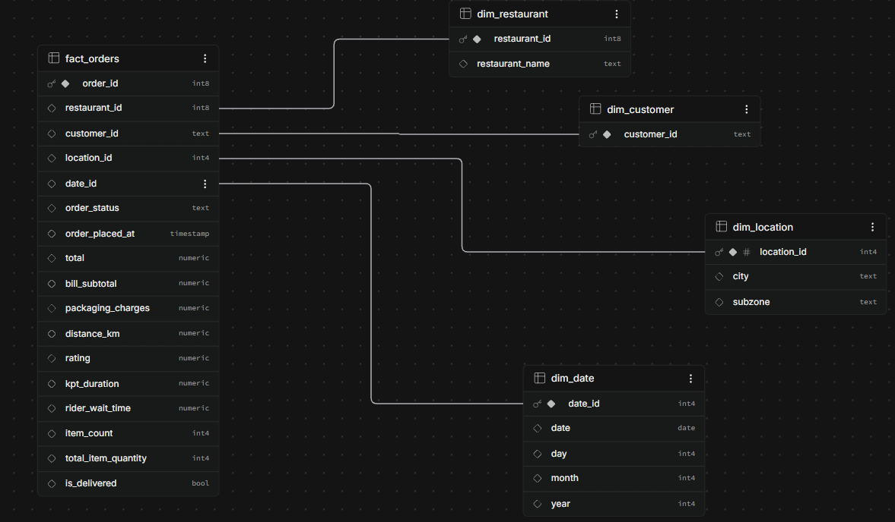

# Food Delivery Data Engineering Pipeline

A Python-based data engineering pipeline that extracts food delivery order data from a CSV dataset, performs data cleaning and transformation, validates the data, models it using a star schema, and incrementally loads it into PostgreSQL hosted on Supabase.
## Project Overview

This project demonstrates an end-to-end ETL pipeline for food delivery data.

The pipeline:

1. Extracts raw order data from a CSV file
2. Cleans and transforms the data using Pandas
3. Validates the transformed data
4. Creates dimension and fact tables using a star schema
5. Incrementally loads the data into PostgreSQL
6. Records pipeline execution metadata for auditing
7. Can be executed directly using Python or orchestrated using Apache Airflow
8. Provides SQL queries for analytical use cases

## Architecture

```text
                    Apache Airflow
                 (Orchestration Layer)
                         |
                         v
                  Extract & Transform
                         |
                         v
                    Data Modeling
                         |
              +----------+----------+
              |          |          |
              v          v          v
          Dimensions    Fact     Validation
              |          |
              +----------+----------+
                         |
                         v
                PostgreSQL / Supabase
                    |            |
                    v            v
              SQL Analytics   Audit Table
```
## Tech Stack

- **Python** – Pipeline development
- **Pandas** – Data processing and transformation
- **SQLAlchemy** – Database connectivity
- **PostgreSQL** – Relational database
- **Supabase** – Hosted PostgreSQL
- **Apache Airflow** – Pipeline orchestration
- **Docker** – Local Airflow environment
- **SQL** – Database schema and analytics

## Dataset

The project uses a food delivery order history dataset containing **21,321 orders** and **29 attributes**.

The dataset includes information about:

- Restaurants and customers
- Order status and timestamps
- Order values and discounts
- Delivery distance
- Ratings and reviews
- Cancellation and rejection details
- Delivery performance metrics

## Project Structure

```text
food-delivery-data-pipeline/

├── dags/
│   └── pipeline.py
│
├── data/
│   ├── raw/
│   │   └── order_history_kaggle_data.csv
│   └── intermediate/
│
├── docs/
│   └── schema.png
│
├── src/
│   ├── __init__.py
|   |
|   ├── main.py
│   │
│   ├── extraction/
│   │   └── extract.py
│   │
│   ├── transformation/
│   │   └── transform.py
│   │
│   ├── modeling/
│   │   ├── dimensions.py
│   │   └── fact.py
│   │
│   ├── loading/
│   │   ├── dimension_loader.py
│   │   └── fact_loader.py
│   │
│   ├── monitoring/
│   │   └── audit.py
│   │
│   └── utils/
│       └── logger.py
│
├── .env
├── .gitignore
├── docker-compose.yaml
├── requirements.txt
└── README.md
```

## ETL Pipeline

The pipeline follows an **Extract, Transform, Load (ETL)** approach.

### Extract

Raw food delivery data is extracted from a CSV file using Pandas.

### Transform

The extracted data is cleaned, validated, and transformed. Derived fields such as delivery distance, discount type, item count, total item quantity, and delivery status are generated.

The transformed data is then organized into a **star schema** consisting of fact and dimension tables.

### Load

The dimension and fact tables are incrementally loaded into PostgreSQL hosted on Supabase. Existing records are identified using their keys, and only new records are inserted.

## Data Modeling

The project uses a star schema for analytical data modeling.

The central fact table contains order-level transactional data, while dimension tables contain descriptive information about entities such as restaurants, customers, locations, and dates.

## Star Schema


              
## Setup

### 1. Clone the repository

```bash
git clone https://github.com/sreyas-b-anand/de-project.git
cd de-project
```

### 2. Create a virtual environment

```bash
python -m venv .venv
```

### 3. Activate the virtual environment

Windows PowerShell:

```bash
.venv\Scripts\Activate.ps1
```

Linux / macOS:

```bash
source .venv/bin/activate
```

### 4. Install dependencies

```bash
pip install -r requirements.txt
```

### 5. Configure environment variables

Create a `.env` file in the project root:

```env
DATABASE_URL=your_postgresql_connection_string

AIRFLOW_DB_USER=airflow
AIRFLOW_DB_PASSWORD=your_airflow_db_password
AIRFLOW_DB_NAME=airflow

AIRFLOW_ADMIN_USERNAME=airflow
AIRFLOW_ADMIN_PASSWORD=your_airflow_admin_password
AIRFLOW_ADMIN_EMAIL=your_email

AIRFLOW_SECRET_KEY=your_airflow_secret_key
```

### 6. Add the dataset

Place the raw CSV file at:

```text
data/raw/order_history_kaggle_data.csv
```

## Running the Pipeline

### Option 1: Run with Python

From the project root:

```bash
python -m src.main
```

This runs the ETL pipeline directly using Python without Airflow.

### Option 2: Run with Apache Airflow

Make sure Docker Desktop is running.

Start the Airflow environment:

```bash
docker compose up -d
```

If this is the first time setting up Airflow, initialize the Airflow database:

```bash
docker compose up airflow-init
```

Open the Airflow UI:

```text
http://localhost:8080
```

Log in using the Airflow admin credentials configured in `.env`.

Trigger the `food_delivery_pipeline` DAG from the Airflow UI.

To stop the Airflow environment:

```bash
docker compose down
```